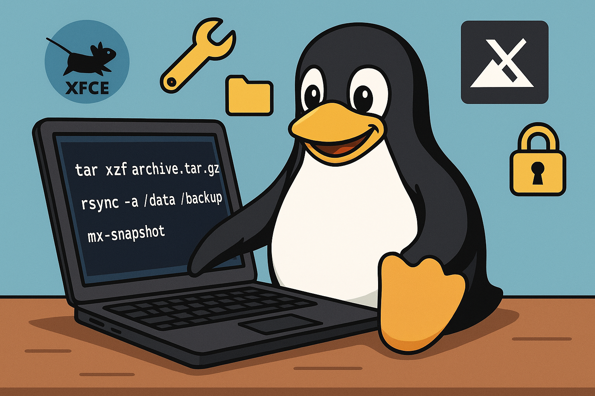

# 🧰 MX Linux ISO Toolbox – Script de Personnalisation et Snapshot

Ce projet propose une série de scripts permettant de configurer automatiquement une instance de **MX Linux XFCE** en un environnement de type **"boîte à outils système"** prêt à être transformé en ISO live grâce à `mx-snapshot`.

L’objectif est de créer une ISO personnalisée intégrant les outils de récupération, maintenance, analyse réseau et configuration système, tout en allégeant l’environnement de base.

* * *

## 📁 Arborescence du projet

Le dépôt est organisé comme suit :

- **config/** : fichiers systèmes à copier (sudoers, rules polkit, exclusions snapshot, variables d’environnement…)
    
- **desktop/** : fichiers `.desktop` personnalisés pour les applications de récupération
    
- **icons/** : icônes SVG pour les raccourcis
    
- **img/** : bannière ou éléments visuels pour illustration/documentation
    
- **script/** : tous les scripts de configuration et installation
    
- **txt/** : listes des paquets à installer ou à supprimer (`apt.txt`, `remove.txt`)
    
- **Install** : script principal à exécuter
    
- **README.md** : ce fichier d'explication
    
- **LICENSE** : licence libre du projet
    

* * *

## ⚙️ Fonctionnement général

L'installation se déroule en plusieurs étapes automatisées grâce au script principal `Install`, que l'on exécute depuis une session utilisateur classique (non root).

### 1\. Vérifications préalables

Le script `Install` vérifie :

- que l'utilisateur n'est pas root
    
- que la distribution est bien **MX Linux**
    
- que l’environnement de bureau est **XFCE**
    

### 2\. Déploiement de la configuration

Décompression et installation des paramètres utilisateur à partir de l'archive `config_mx_linux.tar.gz` :

```bash
tar -xvzf config/config_mx_linux.tar.gz
rsync -a --chown="$util:$util" .config/ /home/$util/.config/
```

### 3\. Installation de composants

Appel de plusieurs sous-scripts situés dans le dossier `script/` :

- `install_begin` : applique les configurations systèmes (rsync vers `/etc`, sudoers, polkit, LightDM…)
    
- `apt_install` : installe les paquets utiles, supprime les superflus
    
- `bookmark_install` : insère des marque-pages dans Thunar/Firefox (si présent)
    
- `themes_and_icons_install` : installe les thèmes graphiques Qogir, Tela, et le curseur Oreo
    

### 4\. Nettoyage (si exécuté dans une VM VirtualBox)

Suppression des fichiers `.vbox*` de l'utilisateur pour éviter leur présence dans l’ISO.

```bash
rm -f /home/$util/.vbox*

```

### 5\. Création de l’ISO personnalisée

Une fois l’environnement prêt, le script lance :

```bash
sudo mx-snapshot -c
```

Cela lance la création de l’image ISO basée sur la configuration actuelle.

* * *

## 📦 Liste des logiciels installés

La liste complète se trouve dans `txt/apt.txt`. Elle inclut notamment :

- **Sauvegarde & Récupération** : Clonezilla, Testdisk, Photorec, Partclone, FSArchiver, Extundelete
    
- **Diagnostic matériel** : lshw, gsmartcontrol, inxi, hardinfo
    
- **Analyse réseau** : EtherApe, Nmap, iPerf3, Traceroute, Net-tools
    
- **Nettoyage** : Bleachbit, Ncdu, Htop, Iotop
    
- **Utilitaires système** : GParted, Disques GNOME, rsync, numlockx
    
- **Sécurité & Antivirus** : ClamTK
    
- **Dev/Outils terminal** : Git, Crudini, XFCE Terminal
    

* * *

## 🧹 Logiciels supprimés

Liste dans `txt/remove.txt`. Cela inclut :

- Jeux
    
- LibreOffice
    
- Thunderbird
    
- Éditeurs alternatifs (Geany, Featherpad)
    
- Lecteurs multimédia non essentiels (VLC, Strawberry…)
    
- Outils GNOME inutiles ou doublons
    

* * *

## 🖼️ Apparence personnalisée

Le script `themes_and_icons_install` applique un thème sombre **Qogir**, des icônes **Tela red**, et le curseur **Oreo Spark Violet**.

Les fichiers `.desktop` dans le dossier `desktop/` sont adaptés pour un affichage clair dans le menu d'application.

* * *

## 🚀 Utilisation

Depuis une session utilisateur sur MX Linux XFCE :

```bash
./Install
```

Une fois l’ISO générée, elle pourra être testée dans VirtualBox ou gravée sur une clé USB pour une utilisation en mode live.

* * *

## 🔒 Remarques

- Le fichier `sudoers` personnalisé est copié avec les bonnes permissions :

```bash
chmod 440 /etc/sudoers
```

- Les règles Polkit désactivent les demandes de mot de passe pour certaines actions via `disable-passwords.rules`.

* * *

## 📜 Licence

Projet distribué sous licence libre GPL3. Voir fichier `LICENSE`.